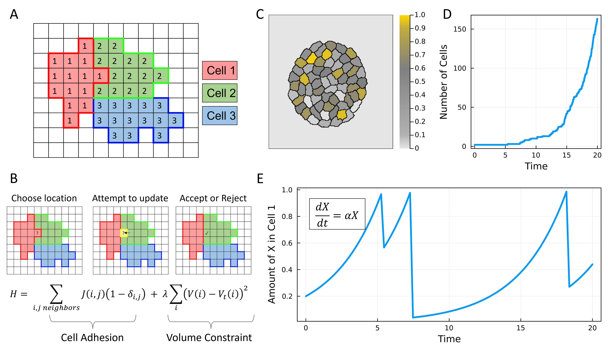

#  CellularPotts.jl

[docs-img]: https://img.shields.io/badge/docs-dev-blue.svg
[docs-url]: https://robertgregg.github.io/CellularPotts.jl/dev/

[![][docs-img]][docs-url]

**CellularPotts.jl** is a Julia package designed to simulate behaviors observed in biological cells. These behaviors can be as simple as cell adhesion, or as complex as entire multi-scale models. Users of this package can create 2D and 3D environments with any number of cell types, sizes, and behaviors. Simulations can be recorded and visualized as animations with the help of the Plots.jl package. The goals of this package are to create a flexible coding environment to explore how cell behaviors can coalesce into complex dynamics while still maintaining high performance. Compared to other excellent software for Cellular Potts modeling (e.g., [Morpheus](https://morpheus.gitlab.io/), [Artistoo](https://artistoo.net/), [CompuCell3D](https://compucell3d.org/)), CellularPotts.jl is unique in its approach for a few reasons:

- CellularPotts.jl is written completely in Julia, avoiding the "[two language problem](https://www.nature.com/articles/d41586-019-02310-3)"
  
  - This unites developers and users to one language, simplifies the code base, and makes customization easier.

- The space cells occupy is modeled as a network/graph
  
  - Representing the model as a graph allows access to decades of graph theory research, for example:
    
    - Calculating articulation points to avoid cell fragmentation
    - Using graph partitioning algorithms to simulate cellular division
    - Avoiding cumbersome boundary conditions by simply adding edges that loop around
    - Using graphical Laplacians to simulate diffusion

- CellularPotts.jl can be composed with other Julia packages.
  
  - For example, we can use state-of-the-art differential equation solving techniques from [DifferentialEquations.jl](https://diffeq.sciml.ai/stable/) as opposed to simple Euler methods

## What is Cellular Potts Modeling?

[CPMs](https://en.wikipedia.org/wiki/Cellular_Potts_model) work by defining an integer grid where adjacent sites with the same value comprise an individual cell (Figure 1A). Locations with a value of zero represent empty regions where no cell is present. The model uses a Metropolis–Hastings algorithm to update grid sites to match their neighbors. This process depends on given penalties which can, for example, encourage cells to adhere together or maintain its size (Figure 1B). As these steps are applied to the grid, patterns observed in real cellular systems begin to emerge. The original CPM paper demonstrated how cells can sort themselves given the correct penalties. Over the next 30 years, this modeling paradigm has been updated to include cell migration,  chemotaxis, intracellular forces, and cell signaling.



## Want to Contribute?

Careful attention has been taken to ensure this package is as performant as I can possibly make it, however, if you spot something egregious in the package, feel free to raise an issue or pull request.

Also of note, **this package is still in development and is not currently recommended for general use**. However, still feel free to try it and gice suggestions if you're curious. 

## Quick Start

To create a basic Cellular Potts Model, you need provide 3 pieces of information:

1.  What space will the cells occupy?

2.  What cells do you want to include in the model?

3. What penalties do you want to add to encourage certain behaviors?

```julia
#Install the package (if needed)
using Pkg; Pkg.add("CellularPotts")

#Load in the package
using CellularPotts

#Create a space (50×50) for cells to exist in
space = CellSpace(50,50; isPeriodic=true, neighborhood=:moore)

#Describe the cells in the model
initialCellState = CellTable(
    [:Epithelial], #names
    [500],         #sizes
    [1])           #counts

#Add penalties to the model
penalties = [
    AdhesionPenalty([0 20;
                     20 0]),
    VolumePenalty([5])
    ]

#Create a model object
cpm = CellPotts(space, initialCellState, penalties)

#Record a simulation of the model
recordCPM("ReadMeExample.gif", cpm)
```


## Major Improvements

- [ ] Introduce more cell properties
  
  - [x] Division
  - [x] Death
  - [x] Active movement
  - [ ] Movement up gradients (implemented but needs some testing)

- [x] Integrate hybrid modeling schemes
  
  - [x] ODE Modeling (intracellular)
  
  - [x] PDE Modeling (extracellular + intracellular)
  
  - Maybe use [Neural networks](https://github.com/SciML/NeuralPDE.jl) to speed up the PDE computation?
  
  - Stochastic jumps?

- [x] Create an Examples folder

- [x] How to save output? (created separate structure to log history)
  
  - Save the data into a dictionary of dataframes
  - Needs to be made more efficient

- [x] Implement different ways to initialize cell locations
  
  - [x] Image input
  - [x] specify locations with property

- [x] Allow cells to have different properties (used `NamedTuple`)

- [ ] Use automatic differentiation to calculate [cellular forces](https://journals.plos.org/ploscompbiol/article?id=10.1371/journal.pcbi.1007459) from the Hamiltonian

- [x] Add a correction factor to adhesion to deal with boundaries.

- [ ] Create unit tests for reproducibility

## Minor Improvements

- [x] Allow user defined parameters to cells (used `NamedTuple`)
  - Not sure how users will integrate these parameters into the model...
- [x] Allow cells of the same type to be different sizes (?)
  - Just specify different desired volumes
- [x] Could get a big speed improvement if you don't loop through all cells to update articulation points
  - Need to be clever about updating articulation points locally (is this possible?)
  - rewrote [Tarjan's algoirthm](https://en.wikipedia.org/wiki/Biconnected_component) to find articulation points which is O(V+E)
  - Is only checked with a successful update.
- [x] Adding cell borders is slow for large spaces
  - fixed by using NA
- [ ] Be more consistent with typing (e.g. `AbstractVector` vs `Vector`) without creating type instability
- [x] Do we even need to track to total energy? (nope!)
- [ ] Use SVectors to store graph edges? 🤔
  - Only useful for spaces where all nodes are identical (e.g., periodic boundaries)
- [ ] Add more tests and CI badge